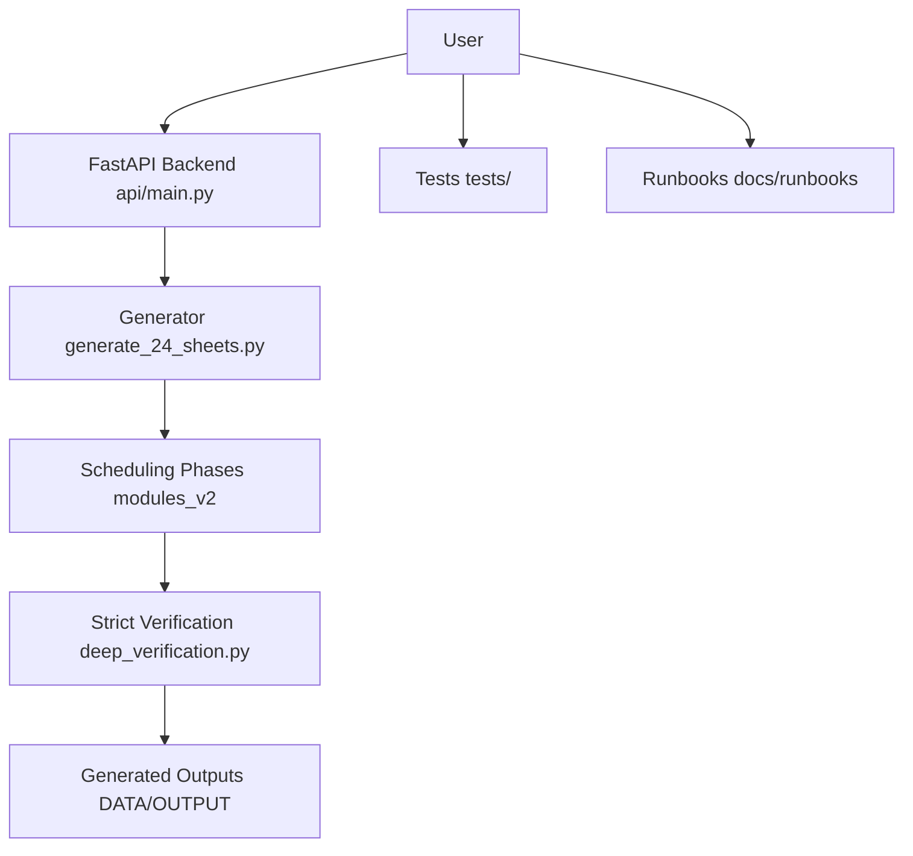
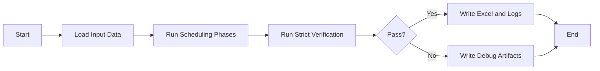

# ARISE Timetable Project Manual

This manual explains the project in simple language and gives professional run workflows.
If you follow this file step by step, you can run the project safely even if you are new.

---

## 1) What This Project Does

The project creates institute timetables and verifies them with strict academic rules.

Main outcomes:
- Generate timetable sheets (Excel)
- Verify hard constraints (classroom, faculty, overlaps, LTPSC, sync rules)
- Support API and UI verification/edit flows
- Run stability tests on odd and even datasets

---

## 2) Project Map (Big Picture)



---

## 3) Important Folders

- `api/` - backend endpoints used by UI and tools
- `modules_v2/` - phase-wise scheduling logic
- `utils/` - shared helpers (models, conflict checks, writers)
- `config/` - structure and schedule settings
- `DATA/INPUT/` - required input Excel files
- `DATA/OUTPUT/` - generated timetable outputs
- `DATA/DEBUG/` - strict/stability debug reports
- `tests/` - professional test entry layer
- `docs/runbooks/` - quick-start and troubleshooting docs
- `artifacts/archive/` - archived logs/text/exports

---

## 4) Setup (First Time)

### Backend

1. Open terminal in repo root.
2. Install dependencies:
   - `pip install -r requirements.txt`
   - `pip install -r api/requirements.txt`

### Frontend

1. Go to frontend:
   - `cd frontend`
2. Install:
   - `npm install`

---

## 5) Core Workflows

## A) Standard Generate + Strict Verify

Use this when you want final timetable output with strict checks.

Command:
- `python generate_and_verify.py`

What happens:
1. Data is loaded from `DATA/INPUT`
2. Scheduling phases run
3. Strict verification executes
4. Excel + logs are written if pass



## B) API Flow (UI/Integration)

Start API:
- `python api/main.py`

Main usage:
- Generate from API/UI
- Verify session payloads
- Reflow/generate-from-sessions when editing

```mermaid
flowchart TD
    client[Frontend or Client]
    generate[/api/generate]
    verify[/api/verify]
    reflow[/api/reflow or generate-from-sessions]
    backend[api/main.py]
    deep[deep_verification.py]

    client --> generate --> backend
    client --> verify --> backend --> deep
    client --> reflow --> backend --> deep
```

## C) Stability Validation (Odd + Even)

Use this to prove reliability before handover/release.

Smoke:
- `python run_dual_dataset_strict.py --runs 1 --timeout-seconds 600 --seed-mode fixed`

Full:
- `python run_dual_dataset_strict.py --runs 10 --timeout-seconds 600 --seed-mode fixed`

Result file:
- `DATA/DEBUG/strict_stability_*.json`

---

## 6) Test Workflows

Smoke tests:
- `python -m unittest discover -s tests/smoke -p "test_*.py"`

Regression tests:
- `python -m unittest discover -s tests/regression -p "test_*.py"`

Stability entry tests:
- `python -m unittest discover -s tests/stability -p "test_*.py"`

Legacy tests (moved from root):
- `tests/legacy/`

---

## 7) Rules for Safe Contribution

Before changing anything:
1. Keep `DATA/INPUT` files safe.
2. Do not edit generation semantics unless required.
3. Use strict verification after changes.
4. Run odd/even stability before final merge.

After changing code:
1. Run smoke + regression tests.
2. Run one stability smoke run (`--runs 1`).
3. If release-level change, run full (`--runs 10`).

---

## 8) Understanding Prompts (Phase 4/7)

Current behavior:
- Group 1 and Group 2 behavior preserved as implemented.
- Group 3+:
  - ask first time in terminal
  - save decision
  - reuse saved decision in next runs
  - no forced linkage to Group 1/2

---

## 9) Which Files Are Required vs Generated

Required:
- Source folders (`api`, `modules_v2`, `utils`, `config`)
- Input files in `DATA/INPUT`
- Dependency files

Generated (safe to archive):
- `DATA/OUTPUT/*`
- `DATA/DEBUG/*`
- `DATA/EDITED OUTPUT/*`
- local debug `.txt/.log` artifacts

Archive location used:
- `artifacts/archive/`

---

## 10) Troubleshooting Quick Guide

- If no `time_slot_log_*.csv` exists:
  - run `python generate_and_verify.py`
- If strict verification fails:
  - inspect latest `DATA/DEBUG/strict_stability_*.json`
  - rerun one fixed-seed smoke:
    - `python run_dual_dataset_strict.py --runs 1 --timeout-seconds 600 --seed-mode fixed`
- If terminal prompts block automation:
  - set `ARISE_NONINTERACTIVE=1`

---

## 11) Handover Checklist (Release Ready)

- [ ] `python -m unittest discover -s tests/smoke -p "test_*.py"` passes
- [ ] `python -m unittest discover -s tests/regression -p "test_*.py"` passes
- [ ] `python generate_and_verify.py` passes
- [ ] `python run_dual_dataset_strict.py --runs 10 --timeout-seconds 600 --seed-mode fixed` passes
- [ ] outputs + report files generated successfully
- [ ] manual and runbooks are up to date

---

## 12) Related Docs

- `docs/runbooks/quick_start.md`
- `docs/runbooks/verification_and_troubleshooting.md`
- `tests/README.md`

